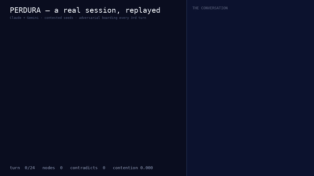

# Perdura

**The mind that outlives its models.**

Perdura is a persistent knowledge graph that hires and fires LLMs based on
what it has learned about them — spending money only where it disagrees with
itself.

Conventional multi-agent systems treat agents as persistent and memory as
incidental. Perdura inverts this: **memory is the persistent entity; LLMs are
ephemeral workers** that board, contribute graph deltas, and disembark.
Because no working state ever lives inside a model, any model can be swapped
mid-task with zero loss. The mind survives every model that ever powered it.

> *Perdura* — from **perdurantism**, the philosophy that a thing persists as a
> series of temporal parts rather than one enduring object. Also literally
> "it endures" (Spanish / Italian / Portuguese).

## The three claims

1. **Inverted persistence.** The graph is the system of record. Models are
   stateless, commodity labor — swappable at any station because the state
   rides the train, not the worker.
2. **Per-model epistemic track records.** Every node is attributed. Over time
   the graph learns which models are reliable in which domains. The memory
   evaluates its workers.
3. **Contention-driven economics.** Cheap local models are the default labor
   force. Frontier and specialist models are summoned only where
   contradiction density rises in the graph.

## Quickstart

```bash
pip install -r requirements.txt
export ANTHROPIC_API_KEY=...
export GEMINI_API_KEY=...
# local labor: LM Studio serving qwen3-14b on :1234 (default), Ollama also works

# Try the loop offline first (no API keys needed)
python perdura.py demo

# Seed the mind with its first question
python perdura.py new "What memory compaction policy best preserves epistemic history?"

# Run worker turns (round-robin: qwen -> claude -> gemini)
python perdura.py run --turns 6

# Inspect the graph and proto track records
python perdura.py show
```

All-local labor: `python perdura.py run --turns 10 --workers qwen`
Ollama instead of LM Studio: `--qwen-url http://localhost:11434/v1 --qwen-model qwen3:14b`
Manufacture contention (devil's-advocate every 3rd turn): `--adversarial-every 3`
Visualize the graph: `python perdura.py viz` → `perdura_mindmap.html`
Per-model reliability scorecard: `python perdura.py track`
Surface latent disagreement (stance audit every 4th turn): `--audit-every 4`
**Live dashboard** (watch a session land in real time): `python perdura.py ui` → http://127.0.0.1:8800
SQLite storage (multi-process, transactional — see below): `--graph perdura.db`
**The router** (Phase 3 — local labor by default, frontier summoned on contention): `--route contention --budget 6`

## How it works

- **Knowledge graph** — typed nodes (`question`, `claim`, `evidence`,
  `decision`, `rejected`) and typed edges (`supports`, `contradicts`,
  `refines`, `answers`, `depends_on`). Append-mostly: nodes are superseded,
  never deleted, preserving the temporal record of how the mind changed.
- **Workers** — any LLM behind a uniform interface. A worker sees a bounded
  briefing (the 2-hop neighborhood of the most-contended open question),
  never a transcript and never authorship of prior nodes, and returns a
  strict-JSON delta.
- **Conductor** — deterministic code. Validates deltas, stamps attribution,
  merges, and recomputes contention. No LLM judgment in the merge path.
- **Contention** — confidence-weighted `contradicts` edges per claim,
  optionally blended with memoric-binary embedding scatter
  (`--memoric-weight 0.5`; default stays edge-only until Phase 0 validation
  passes). It prioritizes which question gets worked next, and (Phase 3)
  decides when to escalate from local to frontier or specialist models.

Full design rationale: [docs/design.md](docs/design.md) ·
Visual overview: [docs/overview.html](docs/overview.html) ·
Validation results: [docs/phase0-validation.md](docs/phase0-validation.md) ·
Enterprise plan: [docs/enterprise.md](docs/enterprise.md)

## Beyond the experiment: storage tiers and compliance

The graph is the only state, so persistence is pluggable
(`perdura_store.py`), selected by file extension — everything above it
(conductor, Station, MCP, viz, track) is unchanged:

- `perdura_graph.json` (default) — byte-identical Phase 1 behavior,
  human-diffable, single box.
- `perdura_graph.db` / `.sqlite[3]` — SQLite in WAL mode: transactional
  saves, concurrent readers while a conductor writes, multi-process safe
  on one box (validated 60/60 merges under 4 concurrent conductors).
- Postgres (planned, enterprise track E2) — same interface,
  graph-per-tenant.

`python perdura.py redact <node-id>` is the operator-only compliance
escape hatch (GDPR erasure vs supersede-never-delete): the text payload is
destroyed; type, confidence, attribution, edges, and lineage survive, so
the epistemic record stays intact while the content does not. The full
deployment plan — integration planes, tenancy, security posture, the
enterprise roadmap — is in [docs/enterprise.md](docs/enterprise.md).

## See it run

A real 24-turn Claude + Gemini session, replayed — claims landing as workers
board, adversarial challenges flashing red, contention climbing from zero
(time-compressed preview; [full 74s video with the model conversation](assets/perdura-session.mp4)):



Regenerate from any graph with `tools/render_session_video.py`.

## Findings so far

The claims above are falsifiable, with numeric pass bars. What two live
multi-model sessions and a synthetic ground-truth arm have actually shown:

- **The delta pipeline holds against real models.** 248/248 strict-JSON
  deltas from Claude + Gemini parsed, validated, and merged across two live
  sessions — zero rejected, provider outages survived.
- **Consensus collapse.** Homogeneous frontier workers don't contend: 18
  turns of Claude + Gemini produced *one* contradicts edge. Countered with
  adversarial boarding (`--adversarial-every`), which manufactures
  contention on demand (verified: 0 → 0.13 global contention).
- **The exogeneity finding.** Prompted contradictions are unpredictable by
  construction — no scatter signal precedes a critic who attacks wherever
  it boards. Hidden-disagreement detection (Phase 0, experiment 1) must be
  validated on *organic* contention from heterogeneous workers.
- **First real track records.** Outcome-based reliability separated live
  workers (0.667 vs 0.400) — claim 2's machinery now runs on real data.
- **The inversion finding.** Contradicting claims are lexically *closer*
  than random pairs (simhash AUC 0.296 — inverted): same topic, opposite
  stance, which no hash can see. So memoric distance is a disagreement
  *locator*, not a measure — the collision detector flags close-but-unlinked
  pairs and a stance auditor (`--audit-every`) judges agree-vs-oppose,
  surfacing *organic* contradictions through the normal merge path.
- **Anchoring is real.** High-confidence claims get challenged less
  (0.227 vs 0.333 challenge rate) even with authorship hidden;
  `--mask-confidence` exists to test the fix.

**The decisive experiment still ahead:** does contention-triggered
escalation flip outcomes more often than random or periodic escalation at
equal cost? Yes proves the thesis; no falsifies it cheaply — either is a
result. The machinery is now built and waiting on real workers: the router
(`--route contention|periodic|random|cheap`, hard budgets, escalation by
live track records) and the A/B harness
(`experiments/escalation_ab.py`), whose synthetic positive control already
shows the targeting separation — at equal spend and equal flips, mean
contention at the moment of escalation is 0.48 (contention-routed) vs 0.31
(random) vs 0.14 (periodic).

## The MCP station

Any MCP client — Claude Code, Claude Desktop, Cursor, a custom agent — can
board as an ephemeral worker:

```bash
pip install -e ".[server]"
python perdura_server.py --graph /abs/path/perdura_graph.json   # stdio
python perdura_server.py --http --port 8000                     # remote
```

Workers receive bounded briefings and contribute strict-JSON deltas;
attribution and track records stay hidden from them. Run a separate
instance with `--operator` for the unredacted view.

## Roadmap

| Phase | Scope | Status |
|---|---|---|
| 1 | Graph memory + delta extraction (Claude, Gemini, local Qwen), JSON persistence, round-robin boarding, CLI + MCP station | ✅ built |
| 0 | Memoric binary: 96-bit epistemic encoding + validation experiments | 🔬 validating |
| 1.5 | Pluggable retrieval (`--retriever graph\|hybrid\|chroma`, BM25 + dense + graph expansion) and force-directed mind-map viz (`perdura.py viz`) | 🛠️ in progress |
| 2 | Attribution analytics: per-model, per-domain track records from claim outcomes (`perdura.py track`) | 🛠️ engine shipped — accumulating real outcome data |
| 3 | The epistemic router: registry, contention-driven escalation, cost budgets, specialist summoning | 🛠️ kernel shipped (`--route`) — decisive A/B awaits real workers |

## Repository layout

```
perdura.py            Phase 1 implementation (graph, conductor, workers, CLI)
docs/design.md        Full design document (thesis, schema, requirements, risks)
docs/overview.html    Visual overview — architecture as a transit map
docs/phase0-validation.md  Phase 0 validation results (synthetic + real arms)
docs/enterprise.md    Enterprise deployment plan (integration planes, tiers)
perdura_memoric.py    Memoric binary encoder/decoder (Phase 0)
perdura_store.py      Pluggable persistence: JSON file / SQLite WAL (E0)
perdura_retrieval.py  Pluggable retrieval layer (Phase 1.5)
perdura_track.py      Per-model/per-domain track records (Phase 2)
perdura_router.py     The epistemic router — contention-driven escalation (Phase 3)
perdura_viz.py        Force-directed mind-map renderer (Phase 1.5)
perdura_station.py    The Station — live local dashboard (perdura.py ui)
perdura_server.py     MCP station — any MCP client can board as a worker
experiments/          Validation experiments, synthetic session, probes
```

## Status

Early-stage personal research, MIT licensed. APIs, schema, and ideas will
change. Live at [perdura.network](https://perdura.network).
